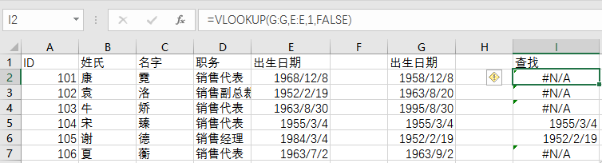
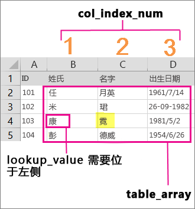

# 查找相同内容的单元格

有时候，我们需要查找两组数据中有重复出现的内容，或者是将2次实验中的重复项找出来进行对比，这时候我们就需要查找相同内容的单元格。

我们可以使用[**LOOKUP**](https://support.office.com/zh-CN/article/LOOKUP-%E5%87%BD%E6%95%B0-446D94AF-663B-451D-8251-369D5E3864CB)这个函数，[`VLOOKUP`](https://support.office.com/zh-CN/article/VLOOKUP-%E5%87%BD%E6%95%B0-0BBC8083-26FE-4963-8AB8-93A18AD188A1)是查找满足选定竖列中内容的单元格，相应地如果要查找满足横行中内容的单元格，则要使用[`HLOOKUP`](https://support.office.com/zh-CN/article/HLOOKUP-%E5%87%BD%E6%95%B0-A3034EEC-B719-4BA3-BB65-E1AD662ED95F)。

```
VLOOKUP（查找目标，查找范围，返回值的列数，精确OR模糊查找)
```

其实关于excel的帮助，直接去查看[Microsoft的帮助网站](https://support.office.com/zh-cn/excel)是最好的，简洁明了。

<iframe src="//videoplayercdn.osi.office.net/hub/?csid=ux-cms-zh-cn-msoffice&uuid=c83dac94-ae67-410a-bf52-5725ce958225&AutoPlayVideo=true&height=415&width=740" frameborder= "0" marginwidth= "0" marginheight= "0" scrolling= "no" allowfullscreen= "" style="width: 740px; height: 415px;"></iframe>

以上是excel的帮助视频，说的是一种情况，说得也很清晰，比如`=VLOOKUP("袁",B2:E7,2,FALSE)`；而现实中我们往往是列与列对比，然后找出其中相同的项，这时我们的公式应该类似`=VLOOKUP("F:F",B:B,1,FALSE)`这样。



再次说一下，这个函数的参数：

| 参数名称 | 说明 |
| -- | -- |
| lookup_value（必需参数） | 要查找的值。要查找的值必须位于 table-array 中指定的单元格区域的第一列中。例如，如果 table-array 指定的单元格为 B2:D7，则 lookup_value 必须位于列 B 中。请参见下图。Lookup_value 可以是值，也可以是单元格引用。 |
| Table_array（必需参数） | VLOOKUP 在其中搜索 lookup_value 和返回值的单元格区域。该单元格区域中的第一列必须包含 lookup_value（例如，下图中的“姓氏”）。此单元格区域中还需要包含您要查找的返回值（例如，下图中的“名字”）。了解如何选择工作表中的区域。 |
| col_index_num（必需参数） | 其中包含返回值的单元格的编号（table-array 最左侧单元格为 1 开始编号）。 |
| range_lookup（可选参数） | 一个逻辑值，指定希望 VLOOKUP 查找精确匹配值还是近似匹配值：TRUE 假定表中的第一列按数字或字母排序，然后搜索最接近的值。这是未指定值时的默认方法。FALSE 在第一列中搜索精确值。 |



当然你不嫌麻烦的话，还可以用`if`来设置条件查找。